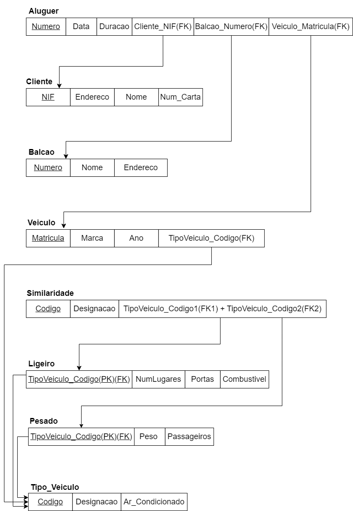
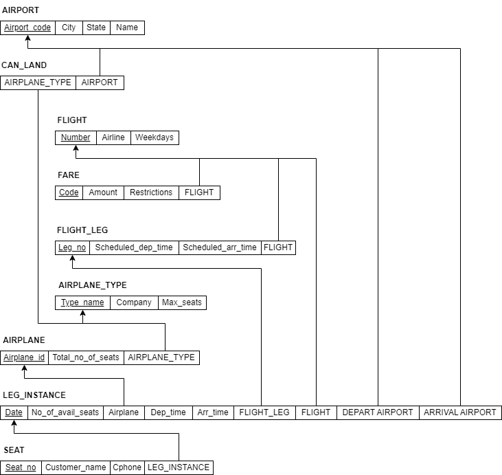
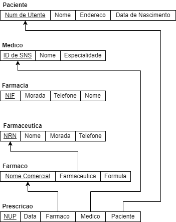
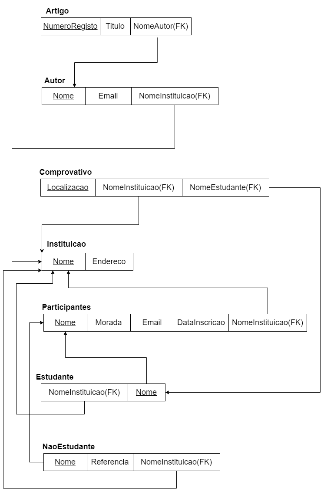
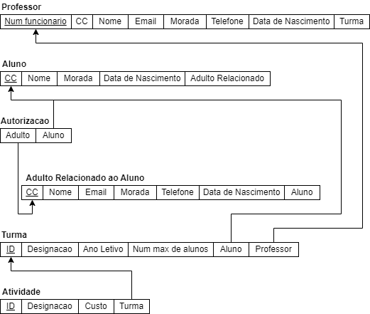

# BD: Guião 3


## ​Problema 3.1

### *a)*

```
Relacoes:
A entidade CLIENTE representa os clientes do servico de Rent-a-Car, sendo que cada um destes é único e identificado pelo seu NIF e pode ainda realizar diferentes alugueres de veículos.

A entidade BALCAO identifica os balcoes de atendimento ou filiais do Rent-a-Car. Cada balcão é identificado por um número único, sendo neles que se realiza os alugueres dos veículos.

A entidade VEICULO representa os veículos disponíveis para aluguer, sendo cada veículo identificado pela sua matrícula.

Relaciona-se ainda com a entidade TIPO_VEICULO que classifica os veículos em diferentes tipos, sendo cada um identificado por um código.

Temos ainda a entidade ALUGUER que representa a ação de um cliente alugar um veículo num determinado balcão, envolvendoas entidades CLIENTE, VEICULO e BALCAO

Esquema de Relacao:
    Cliente (NIF, Endereco, Num_Carta, Nome)
    Aluguer (Numero, Data, Duracao, Cliente_NIF, Balcao_Numero, Veiculo_Matricula)
    Balcao (Numero, Nome, Endereco)
    Veiculo (Matricula, Marca, Ano)
    Tipo Veiculo (Designacao, Ar_Condicionado, Codigo)
    Ligeiro (Num_Lugares, Portas, Combustivel, Tipo_Veiculo_Codigo)
    Pesado (Peso, Passageiros, Tipo_Veiculo_Codigo)
    Similaridade (Tipo_Veiculo_Codigo1, Tipo_Veiculo_Codigo2)
```


### *b)*

```
Chaves candidatas:
    Cliente: NIF, num_carta
    Aluguer: Numero, (Cliente_NIF + Balcao_Numero + Veiculo_Matricula)
    Balcao:Numero
    Veiculo: Matricula
    Tipo Veiculo: Codigo
    Ligeiro: Tipo_Veiculo_Codigo
    Pesado: Tipo_Veiculo_Codigo
    Similaridade: Tipo_Veiculo_Codigo1 + Tipo_Veiculo_Codigo2

Chaves primarias:
    Cliente: NIF
    Aluguer: Numero
    Balcao: Numero
    Veiculo: Matricula
    Tipo Veiculo: Codigo
    Ligeiro: Tipo_Veiculo_Codigo
    Pesado: Tipo_Veiculo_Codigo
    Similaridade: Tipo_Veiculo_Codigo1 + Tipo_Veiculo_Codigo2

Chaves Estrangeiras:
    Cliente: (none)
    Balcao: (none)
    Aluguer: Cliente_NIF, Balcao_Numero, Veiculo_Matricula
    Veiculo: Tipo_Veiculo_Codigo
    Pesado: Tipo_Veiculo_Codigo
    Ligeiro: Tipo_Veiculo_Codigo
    Similaridade: Tipo_Veiculo_Codigo1 + Tipo_Veiculo_Codigo2
```


### *c)*




## ​Problema 3.2

### *a)*

```
Relações:
A entidade AIRPORT representa os aeroportos, sendo cada um identificado unicamente pelo seu código. Cada aeroporto pode receber diferentes tipos de aviões e opera tanto chegadas como partidas.

A entidade AIRPLANE_TYPE denota tipos de aviões, com cada tipo definido por um nome unico. Contém informações sobre a companhia e o número máximo de assentos. Esta entidade está relacionada com aviões individuais e com a capacidade de aeroportos receberem diferentes tipos de aviões.

A entidade AIRPLANE representa cada avião, sendo identificado por um ID único e tendo um tipo associado, que indica qual o modelo do avião. Um avião tem ainda um número total de assentos e pode ter várias instâncias de voos (LEG_INSTANCE).

A entidade SEAT: Os assentos são identificados pelo número do assento e associados a uma instância de voo (LEG_INSTANCE), pois um assento específico só pode ser vendido para um voo específico numa data específica.

A entidade LEG_INSTANCE representa uma ocorrência específica de um segmento de voo (FLIGHT_LEG), com data, número de assentos disponíveis, ID do avião, e informações sobre partida e chegada. Cada LEG_INSTANCE é única para um avião numa data específica e está associada a um único FLIGHT_LEG.

A entidade FARE representa as tarifas. Estas são identificadas por um código e estão associadas a voos específicos, sendo as restrições e o montante especificados para cada tipo de tarifa.

A entidade FLIGHT representa um qualquer voo que é identificado pelo seu número e pode ter diferentes tarifas associadas. Inclui ainda a companhia aérea e os dias da semana em que o voo opera.

A entidade FLIGHT_LEG representa cada segmento de voo, ou seja, é uma parte de um voo, identificado por um número de perna (Leg_no) e associado a um FLIGHT. Inclui ainda informações de partida e chegada de aeroportos específicos e horários programados.

A CAN_LAND representa uma relação que indica quais tipos de aviões podem pousar em quais aeroportos, combinando tipos de aviões e códigos de aeroporto.

Esquema de Relação:
    AIRPORT (AirportCode, City, State, Name)
    AIRPLANE_TYPE (Type_name, Company, Max_seats)
    AIRPLANE (Airplane_ID, Total_no_of_seats, AIRPLANE_TYPE.Type_name)
    SEAT (Seat_no, Customer_name, Cphone, LEG_INSTANCE.Date)
    LEG_INSTANCE (Date, No_of_avail_seats, AIRPLANE.Airplane_ID, Dep_time, Arr_time, Departe AIRPORT.Code, Arrival AIRPORT.Code, FLIGHT.Number, FLIGHT_LEG.no)
    FARE (Restrictions, Amount, Code, FLIGHT.Number)
    FLIGHT (Number, Airline, Weekdays)
    FLIGHT_LEG (Leg_no, Departe AIRPORT.Code, Arrival AIRPORT.Code, Schedule_dep_time, Schedule_arr_time, FLIGHT.Number)
    CAN_LAND (AIRPORT.Airport_code, AIRPLANE.Type_name)
```


### *b)*

```
Chaves candidatas:
	AIRPORT: Airport_code
	AIRPLANE_TYPE: Type_name
	AIRPLANE: Airplane_ID
	SEAT: Seat_no, Date
    LEG_INSTANCE: Airplane_ID, Date
    FARE: Code, FLIGHT.Number
    FLIGHT: Number, Airline
    FLIGHT_LEG: Leg_no,FLIGHT.Number
    CAN_LAND: AIRPORT.Airport_code, AIRPLANE.Type_name
Chaves Primárias:
	AIRPORT: Airport_code
	AIRPLANE_TYPE: Type_name
	AIRPLANE: Airplane_ID
	SEAT: Seat_no + Date
    LEG_INSTANCE: Airplane_ID+Date
    FARE: Code + FLIGHT.Number
    FLIGHT: Number
    FLIGHT_LEG: Leg_no + FLIGHT.Number
    CAN_LAND: AIRPORT.Airport_code + AIRPLANE.Type_name
Chaves Estrangeiras:
	AIRPLANE: Airplane_TYPE.Type_name
	SEAT: LEG_INSTANCE.Date
    LEG_INSTANCE: AIRPLANE.Airplane_ID, FLIGHT.Number, FLIGHT_LEG_no
    FARE: FLIGHT.Number
    FLIGHT_LEG: AIRPORT.Airport_Code, FLIGHT.Number
    CAN_LAND: AIRPORT.Airport_code, AIRPLANE.Type_name
```


### *c)*




## ​Problema 3.3


### *a)* 2.1


### *b)* 2.2



### *c)* 2.3



### *d)* 2.4

